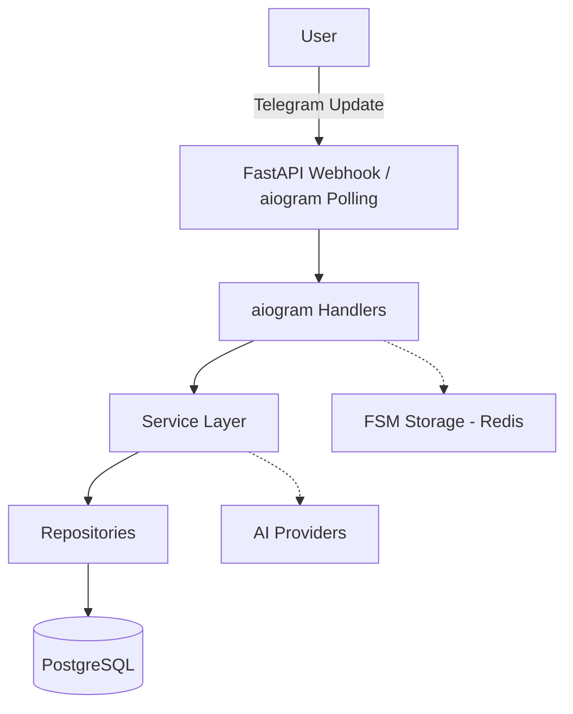

# Architecture Documentation

## Overview
SanjarBot is built on aiogram 3.x with SQLAlchemy 2.0 and PostgreSQL. It uses a Clean Architecture design to separate concerns.

## Clean Architecture
- **Handlers:** Presentation layer (aiogram routers). Handle incoming updates.
- **Services:** Business logic layer.
- **Repositories:** Data access layer (SQLAlchemy).
- **Models:** Database tables.

## Async Flow
All database interactions are strictly asynchronous using `asyncpg` and SQLAlchemy's `AsyncSession`. A connection pool manages database connections efficiently.

## FSM Design
Finite State Machine (FSM) is used for complex user interactions (e.g., multi-step forms). Redis is used as the storage backend for FSM data to ensure persistence across bot restarts and allow horizontal scaling.

## Multi-provider AI Architecture
The bot supports multiple AI providers (OpenAI, Anthropic, local LLMs). The Service layer abstracts the provider interface, allowing easy switching or fallbacks.

## Scheduler
APScheduler is used for background tasks and scheduled reminders, using Redis as the job store.

